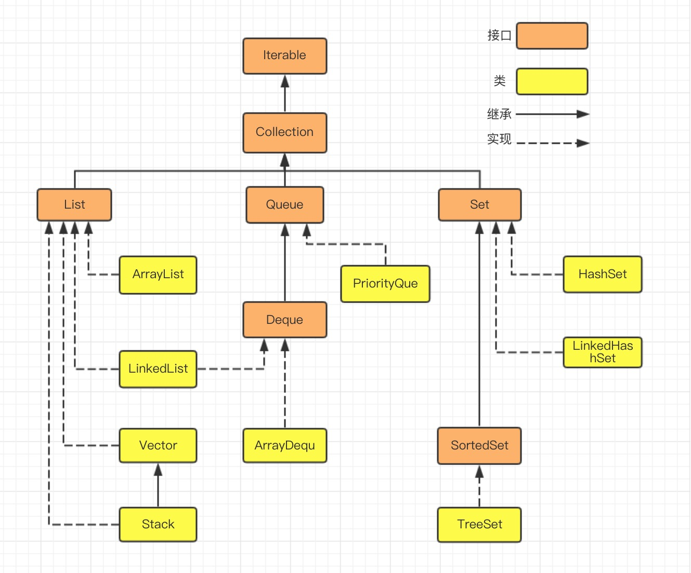
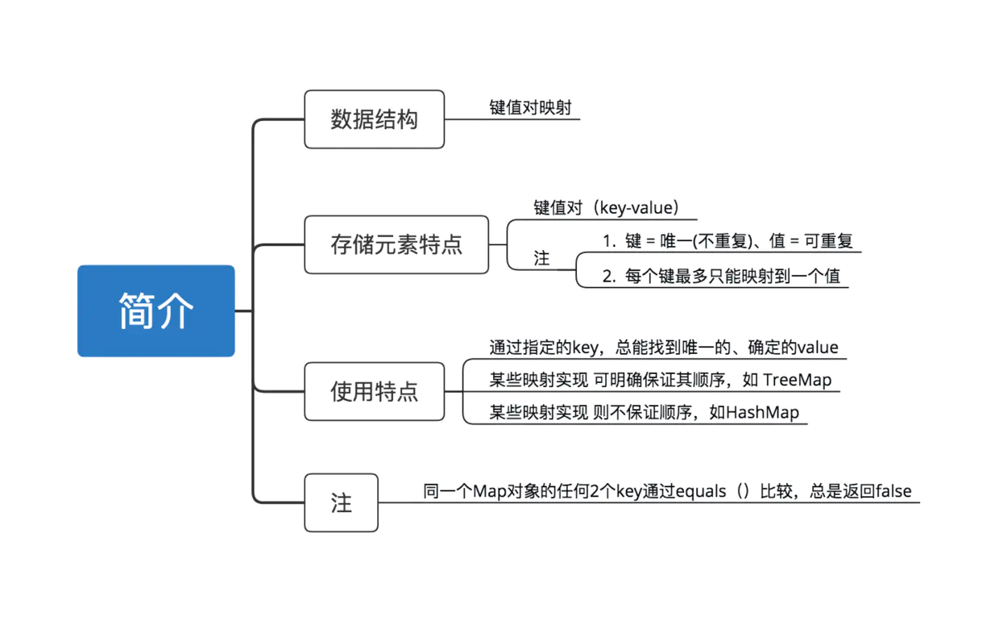
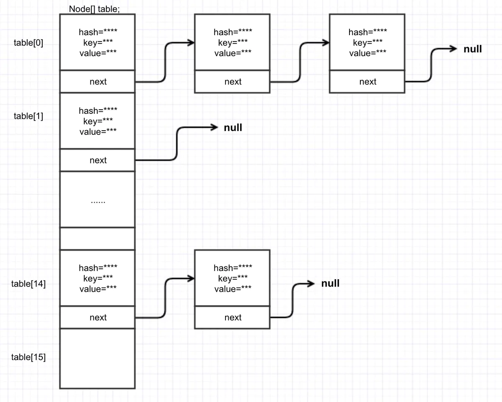

# Java面试炼金系列 (2)  | Map接口、HashMap类的常见面试题剖析

## 0x0 基础知识


> 文章以及源代码已被收录到：https://github.com/mio4/Java-Gold

### 1. 集合体系

Java集合是面试中的重要考点，特别是List和Map接口实现类，属于工作中CRUD最常用的工具，所以经常在面试中出现，用于考察面试者的Java基本功。

Java 集合大致可以分为两大体系，一个是 Collection，另一个是 Map；

- Collection ：主要由List、Set、Queue接口组成，List代表有序、重复的集合；其中Set代表无序、不可重复的集合；Java 5 又增加了Queue体系集合，代表一种队列集合实现。
- Map：则代表具有映射关系的键值对集合。

**java.util.Collection 下的接口和继承类关系简易结构图：**



**java.util.Map 下的接口和继承类关系简易结构图：**


关于集合框架的详细解释会在下节中阐述，本节只关注Map，以及重点内容HashMap。

### 2. Map接口

- Correction、Set、List接口都属于单值的操作，而Map中的每个元素都使用key——>value的形式存储在集合中。
- Map集合：该集合存储键值对。一对一对往里存。而且要保证键的唯一性。




### 3. HashMap实现类

HashMap内部实现细节是面试中最常见的高频考点，除了最基础的用法之外，对于不同版本的底层实现（JDK1.7 和JDK1.8）的细节和区别也需要掌握。

#### 3.1 简介


#### 3.2 底层数据结构：Hash表

**数组**：采用一段连续的存储单元来存储数据。对于指定下标的查找，时间复杂度为O(1)；通过给定值进行查找，需要遍历数组，逐一比对给定关键字和数组元素，时间复杂度为O(n)，当然，对于有序数组，则可采用二分查找，插值查找，斐波那契查找等方式，可将查找复杂度提高为O(logn)；对于一般的插入删除操作，涉及到数组元素的移动，其平均复杂度也为O(n)

**线性链表**：对于链表的新增，删除等操作（在找到指定操作位置后），仅需处理结点间的引用即可，时间复杂度为O(1)，而查找操作需要遍历链表逐一进行比对，复杂度为O(n)

**二叉树**：对一棵相对平衡的有序二叉树，对其进行插入，查找，删除等操作，平均复杂度均为O(logn)。

**哈希表**：相比上述几种数据结构，在哈希表中进行添加，删除，查找等操作，性能十分之高，不考虑哈希冲突的情况下（后面会探讨下哈希冲突的情况），仅需一次定位即可完成，时间复杂度为O(1)，接下来我们就来看看哈希表是如何实现达到惊艳的常数阶O(1)的。

我们知道，数据结构的物理存储结构只有两种：**顺序存储结构**和**链式存储结构**（像栈，队列，树，图等是从逻辑结构去抽象的，映射到内存中，也这两种物理组织形式），而在上面我们提到过，在数组中根据下标查找某个元素，一次定位就可以达到，哈希表利用了这种特性，**哈希表的主干就是数组**。

**比如我们要新增或查找某个元素，我们通过把当前元素的关键字 通过某个函数映射到数组中的某个位置，通过数组下标一次定位就可完成操作。**
　　
这个函数可以简单描述为：**存储位置 = f(关键字)** ，这个函数f一般称为哈希函数，这个函数的设计好坏会直接影响到哈希表的优劣。举个例子，比如我们要在哈希表中执行插入操作：


- **解决哈希冲突**：
  - **如果两个不同的元素，通过哈希函数得出的实际存储地址相同怎么办**？也就是说，当我们对某个元素进行哈希运算，得到一个存储地址，然后要进行插入的时候，发现已经被其他元素占用了，其实这就是所谓的**哈希冲突**，也叫**哈希碰撞**。前面我们提到过，哈希函数的设计至关重要，好的哈希函数会尽可能地保证 计算简单和散列地址分布均匀,但是，我们需要清楚的是，数组是一块连续的固定长度的内存空间，再好的哈希函数也不能保证得到的存储地址绝对不发生冲突。那么哈希冲突如何解决呢？哈希冲突的解决方案有多种:开放定址法（发生冲突，继续寻找下一块未被占用的存储地址），再散列函数法，链地址法，而HashMap即是采用了**链地址法**，也就是**数组+链表**的方式。

#### 3.3 HashMap JDK1.7 实现

`JDK1.7` 中``HashMap` 采用的数据结构 = **数组（主） + 单链表（副）**：（也叫做拉链法）


#### 3.4 HashMap JDK1.8 实现

在原有数据结构（数据+单链表）的基础上引入了红黑树：


## 0x1 高频面试题

## 1. Hashmap是如何解决哈希碰撞问题的？


- JDK1.7中，HashMap就是使用哈希表来存储的。哈希表为解决冲突，可以采用开放地址法和链地址法等来解决问题，Java中HashMap采用了**链地址法**。链地址法，简单来说，就是数组加链表的结合。在每个数组元素上都一个链表结构，当数据被Hash后，得到数组下标，把数据放在对应下标元素的链表上。
- JDK1.8中，链表长度超过8会转换为红黑树，但本质上也是通过在节点上追加生成链表的方式解决哈希冲突。


## 2. Map接口各个实现类之间的区别？（HashMap、LinkedHashMap、TreeMap）


- Hashtable：**Hashtable是遗留类**，很多映射的常用功能与HashMap类似，不同的是它承自Dictionary类，并且是线程安全的，任一时间只有一个线程能写Hashtable，并发性不如ConcurrentHashMap，因为ConcurrentHashMap引入了分段锁。Hashtable不建议在新代码中使用，不需要线程安全的场合可以用HashMap替换，需要线程安全的场合可以用ConcurrentHashMap替换。
- LinkedHashMap：LinkedHashMap是HashMap的一个子类，保存了记录的插入顺序，在用Iterator遍历LinkedHashMap时，先得到的记录肯定是先插入的，也可以在构造时带参数，按照访问次序排序。
- TreeMap：TreeMap实现SortedMap接口，**能够把它保存的记录根据键排序，默认是按键值的升序排序，也可以指定排序的比较器**，当用Iterator遍历TreeMap时，得到的记录是排过序的。如果使用排序的映射，建议使用TreeMap。在使用TreeMap时，key必须实现Comparable接口或者在构造TreeMap传入自定义的Comparator，否则会在运行时抛出java.lang.ClassCastException类型的异常。

总结：使用Iterator迭代器遍历的时候，HashMap的结果是没有排序的，而TreeMap输出的结果是排好序的。


## 3. HashMap和HashSet的区别？

| HashMap                                     | HashSet                                                      |
| ------------------------------------------- | ------------------------------------------------------------ |
| HashMap实现了Map接口                        | HashSet实现了Set接口                                         |
| HashMap储存键值对                           | HashSet仅仅存储对象                                          |
| 使用put()方法将元素放入map中                | 使用add()方法将元素放入set中                                 |
| HashMap中使用键对象来计算hashcode值         | HashSet使用成员对象来计算hashcode值，对于两个对象来说hashcode可能相同，所以equals()方法用来判断对象的相等性，如果两个对象不同的话，那么返回false |
| HashMap比较快，因为是使用唯一的键来获取对象 | HashSet较HashMap来说比较慢                                   |


## 4. 红黑树转换相关问题

### 4.1 链表->红黑树，为什么是长度为8的时候发生转换？

- 要弄明白这个问题，我们首先要明白为什么要转换，这个问题比较简单，因为Map中桶的元素初始化是链表保存的，其查找性能是O(n)，而树结构能将查找性能提升到O(log(n))。当链表长度很小的时候，即使遍历，速度也非常快，但是当链表长度不断变长，肯定会对查询性能有一定的影响，所以才需要转成树。
- **为什么不是一开始就将其转换为TreeNodes？**而是需要一定节点数才转为TreeNodes，说白了就是trade-off，空间和时间的权衡，下面是HashMap的源码注解：

```
Because TreeNodes are about twice the size of regular nodes, we use them only when bins contain enough nodes to warrant use (see TREEIFY_THRESHOLD). And when they become too small (due to removal or resizing) they are converted back to plain bins. In usages with well-distributed user hashCodes, tree bins are rarely used. Ideally, under random hashCodes, the frequency of nodes in bins follows a Poisson distribution (http://en.wikipedia.org/wiki/Poisson_distribution) with a parameter of about 0.5 on average for the default resizing threshold of 0.75, although with a large variance because of resizing granularity. Ignoring variance, the expected occurrences of list size k are (exp(-0.5) * pow(0.5, k) / factorial(k)). The first values are:

0: 0.60653066
1: 0.30326533
2: 0.07581633
3: 0.01263606
4: 0.00157952
5: 0.00015795
6: 0.00001316
7: 0.00000094
8: 0.00000006
more: less than 1 in ten million
```

- 理想情况下，在随机哈希代码下，桶中的节点频率遵循泊松分布，文中给出了桶长度k的频率表。 由频率表可以看出，桶的长度超过8的概率非常非常小。所以作者应该是根据概率统计而选择了8作为阀值，由此可见，这个选择是非常严谨和科学的。
- 另外需要注意的一点是：**链表长度达到8就转成红黑树，当长度降到6就转成普通节点。**

- 总结：
  - TreeNodes占用空间是普通Nodes的两倍，为了空间和时间的权衡，为6时红黑树也比链表快，但转换过程消耗和空间消耗不划算
  - 节点的分布频率会遵循泊松分布，链表长度达到8个元素的概率为0.00000006，几乎是不可能事件
  - 提出来回转化的阈值8和6阈值为什么不一样？**至于为什么转化为红黑树的阈值8和转化为链表的阈值6不一样，是为了避免频繁来回转化**

### 4.2 既然存在链表转换为红黑树，那么是否存在红黑树转换为链表？

HashMap在jdk1.8之后引入了红黑树的概念，表示若桶中链表元素超过8时，会自动转化成红黑树；若桶中元素小于等于6时，树结构还原成链表形式。

- 红黑树的平均查找长度是log(n)，长度为8，查找长度为log(8)=3，链表的平均查找长度为n/2，当长度为8时，平均查找长度为8/2=4，这才有转换成树的必要；链表长度如果是小于等于6，6/2=3，虽然速度也很快的，但是转化为树结构和生成树的时间并不会太短。
- 还有选择6和8的原因是：
  - 中间有个差值7可以防止链表和树之间频繁的转换。假设一下，如果设计成链表个数超过8则链表转换成树结构，链表个数小于8则树结构转换成链表，如果一个HashMap不停的插入、删除元素，链表个数在8左右徘徊，就会频繁的发生树转链表、链表转树，效率会很低。


## 5. HashMap扩容相关问题

### 5.1 HashMap的负载因子是什么？

HashMap中定义的两个参数：

- Initial Capacity：初始化容量，它表示HashMap底层的那个数组，也就是Entry数组有多长，**这个值默认是16。**
- Load Factor：**负载因子**，它表示HashMap的负载程度，换句话说，它表示HashMap到底有多满了，是不是需要扩容了，**这个值默认是0.75f。**

**这两个数值会影响到HashMap的扩容，而扩容是一个对性能影响非常大的操作。**

负载因子大小对**性能**的影响：

- 过小：容易发生reszie，消耗性能
- 过大：容易发生hash碰撞，链表变长，红黑树变高


### 5.2 HashMap扩容操作是什么？发生场景？

**HashMap的扩容**：HashMap被初始化之后，其容量是有限的（可以是默认，也可以是自定义的），当元素不断被插入，是HashMap达到一定的程度（负载因子决定），这个时候，HashMap就会扩容。

**根据源码，使用公式表示，是否扩容由容量和负载因子的乘积决定**

```text
触发扩容的条件：
HashMap.Size   >=  Capacity * LoadFactor
```

- HashMap.Size：当前HashMap的实际元素个数
- Capacity：容量
- LoadFactor：负载因子

如果在默认值的条件下：

```text
HashMap.Size   =  16 * 0.75 = 12
```

也就是，默认的情况下，插入十二个元素的时候，就会触发扩容。


### 5.3 HashMap扩容步骤

一旦HashMap的size超过了Capacity * LoadFactor乘积，就会触发扩容，那如何扩容呢？，需要经过两步：

- resize：即：创建一个new Entry数组，长度是原来old Entry的2倍。
- rehash：遍历old Entry数组，把里面的每一个元素取出来重新计算hash和index。为什么要重新计算呢？想一想之前的index计算公式：

```text
index =  hash值 & （length - 1）
```

对，因为长度已经改了，所以index肯定会不一样，举个例子：

- 当原数组长度为16时，Hash运算是和1111做与运算；
- 新数组长度为32，Hash运算是和11111做与运算。

Hash结果显然不同。


### 5.4 为何HashMap的数组长度一定是2的次幂？

首先从HashMap的`hash`函数说起：

1. `hash`函数：

   ```java
   对key的hashcode进一步进行计算以及二进制位的调整等来保证最终获取的存储位置尽量分布均匀*/
   final int hash(Object k) {
           int h = hashSeed;
           if (0 != h && k instanceof String) {
               return sun.misc.Hashing.stringHash32((String) k);
           }
   
           h ^= k.hashCode();
   
           h ^= (h >>> 20) ^ (h >>> 12);
           return h ^ (h >>> 7) ^ (h >>> 4);
       }
   //例如计算得到哈希值为12345678910111213
   ```

2. `indexFor`函数：

   ```java
   static int indexFor(int h, int length) {
           return h & (length-1);
       }
   //返回得到的数组下标为：123456
   ```

   h&（length-1）保证获取的index一定在数组范围内，举个例子，默认容量16，length-1=15，h=18,转换成二进制计算为index=2。位运算对计算机来说，性能更高一些（HashMap中有大量位运算）

   所以最终存储位置的确定流程是这样的：


3. `resize` 函数：

   ```java
   void resize(int newCapacity) {
           Entry[] oldTable = table;
           int oldCapacity = oldTable.length;
           if (oldCapacity == MAXIMUM_CAPACITY) {
               threshold = Integer.MAX_VALUE;
               return;
           }
   
           Entry[] newTable = new Entry[newCapacity];
           transfer(newTable, initHashSeedAsNeeded(newCapacity));
           table = newTable;
           threshold = (int)Math.min(newCapacity * loadFactor, MAXIMUM_CAPACITY + 1);
       }
   ```

   如果数组进行扩容，数组长度发生变化，而存储位置 index = h&(length-1),index也可能会发生变化，需要重新计算index。

   HashMap的数组长度一定保持2的次幂，比如16的二进制表示为 10000，那么length-1就是15，二进制为01111，同理扩容后的数组长度为32，二进制表示为100000，length-1为31，二进制表示为011111。**这样会保证低位全为1，而扩容后只有一位差异，也就是多出了最左位的1，这样在通过 h&(length-1)的时候，只要h对应的最左边的那一个差异位为0，就能保证得到的新的数组索引和老数组索引一致(大大减少了之前已经散列良好的老数组的数据位置重新调换)。**

   

## 6. 简述一下HashMap中put方法的实现

JDK1.8在JDK1.7的基础上针对增加了红黑树来进行优化。即当链表超过8时，链表就转换为红黑树，利用红黑树快速增删改查的特点提高HashMap的性能，其中会用到红黑树的插入、删除、查找等算法。

具体的实现流程如下：


## 7. ConcurrentHashMap有啥用？谈下你的理解

这个问题要从两个方面来回答：

1. 为什么要用ConcurrentHashMap？
2. ConcurrentHashMap如何保证并发安全？


### 7.1 为什么要用ConcurrentHashMap？

​	HashMap线程不安全，而Hashtable是线程安全，但是它使用了synchronized进行方法同步，插入、读取数据都使用了synchronized，当插入数据的时候不能进行读取（相当于把整个Hashtable都锁住了，全表锁），当多线程并发的情况下，都要竞争同一把锁，导致效率极其低下。而在JDK1.5后为了改进Hashtable的痛点，ConcurrentHashMap应运而生。


### 7.2 ConcurrentHashMap如何保证并发安全？

以JDK1.8 版本分析：

```java
/**
 * The array of bins. Lazily initialized upon first insertion.
 * Size is always a power of two. Accessed directly by iterators.
 * 
 * hash表，在第一次put数据的时候才初始化
 */
transient volatile Node<K,V>[] table;

/**
 * 用来存储一个键值对
 * 
 * Key-value entry.  This class is never exported out as a
 * user-mutable Map.Entry (i.e., one supporting setValue; see
 * MapEntry below), but can be used for read-only traversals used
 * in bulk tasks.  Subclasses of Node with a negative hash field
 * are special, and contain null keys and values (but are never
 * exported).  Otherwise, keys and vals are never null.
 */
static class Node<K,V> implements Map.Entry<K,V> {
    final int hash;
    final K key;
    volatile V val;
    volatile Node<K,V> next;
}
```

JDK8中不在使用Segment的概念，**而是采用了 `CAS + synchronized` 来保证并发安全。**

数据结构类似下图：




同理，可按照分析HashMap的方式来分析PUT和GET函数，不做多述。

相关引申问题：volatile关键词的作用？


---

> Reference

http://www.justdojava.com/2019/09/16/java-collection-1/

https://juejin.im/entry/6844903741229891597

https://blog.csdn.net/woshimaxiao1/article/details/83661464

https://crossoverjie.top/2018/07/23/java-senior/ConcurrentHashMap/

https://blog.csdn.net/qq_36520235/article/details/82417949

https://blog.csdn.net/carson_ho/article/details/79373134

https://www.cnblogs.com/twoheads/p/10667449.html

https://zhuanlan.zhihu.com/p/86001720

https://www.jianshu.com/p/d10256f0ebea

https://juejin.im/post/6844903813892014087#heading-4